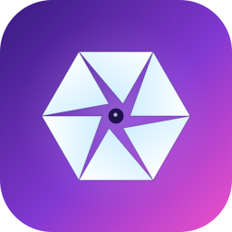

<p align="center">
  
</p>

<h1 align="center">Latent</h1>

<p align="center"><strong>Your photos. Your Mac. Nothing in between.</strong></p>

<p align="center">
  A folder-first photo viewer with a local AI enhancement pipeline.<br>
  No library import, no cloud, no account, no subscription.
</p>

<p align="center">
  <a href="https://github.com/diamondplated/latent/actions/workflows/ci.yml"></a>
  
  
  <a href="LICENSE"></a>
</p>

<p align="center">
  <a href="#quick-start">Quick start</a> ·
  <a href="#what-it-does">Features</a> ·
  <a href="#the-enhancement-pipeline">Pipeline</a> ·
  <a href="THIRD_PARTY_MODELS.md">Models &amp; licensing</a> ·
  <a href="SECURITY.md">Security</a> ·
  <a href="CONTRIBUTING.md">Contributing</a>
</p>

---

## Point it at a folder

Most photo apps want to own your pictures. They import, they catalog, they build a library, and
your files end up somewhere you didn't put them.

Latent opens a folder. That's the whole model. Your directory structure *is* the organization, the
files stay exactly where they are, and everything the app can do runs on your own machine.

- 🗂 **Folder-first.** Drag a folder in, or `open -a Latent ~/Pictures/2024`. No import step, no
  catalog file, no migration when you change your mind.
- ⌨️ **Vim keymap.** `j`/`k`, `gg`/`G`, marks, picks, rejects, colour labels. If you've culled a
  shoot before, your fingers already know it. Saved culling state follows folder renames and moves
  on the same volume.
- ✨ **Four-stage enhancement**, all local — upscale, denoise, artifact removal, sharpen — with
  live A/B compare and non-destructive sidecars.
- 🔎 **Search your own photos locally.** Press `⌘F`, explicitly index the folder, then search by
  description or find visually similar photos. Search needs OpenCLIP assets you supply; Latent
  never downloads them automatically.
- 🌍 **Map view** from EXIF GPS, and Quick Look rendering.
- 🚫 **Zero runtime network calls by default.** Three things reach the network, each because you
  asked for it: a setup script you run yourself, once, to fetch model weights; the map view, which
  is MapKit and fetches its tiles from Apple while it is open; and the optional phone companion
  below, which you switch on per session and which never leaves your LAN. Browsing, indexing, and
  searching never trigger an automatic download.

---

## Install

```sh
brew install --cask diamondplated/tap/latent
```

Or grab the zip from [Releases](https://github.com/diamondplated/latent/releases/latest)
(Apple silicon, macOS 14+).

**macOS will block the first launch** — the current downloadable build is ad-hoc signed and is not
notarized. Ad-hoc signing seals the app for local execution, but it is not an Apple-trusted
Developer ID signature. Approve it once under **System Settings → Privacy & Security**, or strip
the quarantine attribute yourself if you trust the build:

```sh
xattr -dr com.apple.quarantine /Applications/Latent.app
```

The packaging script can use a Developer ID Application identity when
`LATENT_SIGNING_IDENTITY` is set, but the project does not yet automate notarization or stapling.
The script's default remains ad-hoc signing for local and CI builds.

The downloadable build ships no model weights — see [below](#quick-start). It works without them.

---

## Quick start

```bash
swift build
swift run pv-pipeline      # self-verifier — confirms the pipeline works
swift run Latent           # launch the viewer
```

Or build a real `.app`:

```bash
swift scripts/generate_icon.swift      # render the app icon (one-time)
./scripts/build_app.sh
open build/Latent.app
```

**You do not need model weights to run Latent.** With `Resources/Models/` empty, every stage still
works: Sharpen runs classically, Upscale falls back to Lanczos, and the model-backed stages pass
through untouched. Clone, build, browse — that's it.

To enable the AI stages (one-time, ~1.2 GB, needs Python with `coremltools`):

```bash
pip install -r scripts/requirements.txt
./scripts/setup_models.sh
```

Running that script is the explicit model-download step; the app never fetches models in the
background. It also prepares the OpenCLIP image encoder, text encoder, and tokenizer used by
semantic search. Run it before `scripts/build_app.sh` if you want those local assets included in
your own app bundle.

> See [THIRD_PARTY_MODELS.md](THIRD_PARTY_MODELS.md) for what each model is. All four are
> permissively licensed, and downloads are checksum-verified.

### Opening folders

- **Drag a folder onto `Latent.app`** — Dock or Finder icon.
- **Terminal:** `open -a Latent /path/to/folder`
- **In-app:** `⌘O`
- **Right-click an *image* in Finder → Open With → Latent** — opens the parent folder and selects
  that image.

Folders themselves don't show "Open With" in Finder's context menu — that's an OS-level restriction,
not something `Info.plist` can fix. The drag and command-line paths above are the workarounds.

---

## What it does

**Browsing.** Folder tree sidebar (collapsible, lazy, `⌘L`), thumbnail grid with colour labels and
pick/reject state, non-recursive by default with an opt-in **Include Subfolders**, sort by name or
recently-modified, and predictive prefetch so the next image is already decoded. Filesystem changes
refresh the view live; with **Include Subfolders** enabled, the watcher covers the entire subtree,
including deep additions, removals, and renames.

**Culling.** The vim keymap is the point: `j`/`k` to move, `gg`/`G` for ends, `m`+letter to set a
mark and `'`+letter to jump back, digits for colour labels, `⇧P` to pick, one-click trash with `⌘Z`
undo, and bulk select for batch operations. Marks, labels, picks, and rejects are stored outside the
photo folder under a durable macOS folder reference, so they survive renaming the folder or moving
it elsewhere on the same volume. The first time v0.3 finds path-only culling state from v0.2, it
asks you to confirm that this is the same folder before importing; declining leaves the old file
untouched and keeps culling disabled for that folder.

**Viewing.** Synced zoom and pan (0.25–16×, drag to pan, pinch to zoom, double-tap to cycle
2×→3×→4×→1×), animated GIFs, video playback, and a map view built from EXIF GPS.

**Enhancing.** Per-stage toggles and sliders with live preview, A/B compare (enhanced / original /
side-by-side, hold `B` to blink), and `.enhance.json` sidecars so your edits are non-destructive and
diffable.

**Searching.** Press `⌘F` to open folder-scoped semantic search. Opening the search UI only inspects
the saved index; indexing starts when you choose **Index This Folder**, and stale indexes refresh
only when you explicitly request it. Progress and cancellation stay in the search panel. Once
indexed, you can type a description or use **Find Similar** on the current photo. Embeddings are
OpenCLIP ViT-B/32, 512-dimensional, persisted locally per folder, and checked for stale files.
Indexing and Find Similar require a user-supplied OpenCLIP image encoder; text search additionally
requires the text encoder and tokenizer. No search action uploads a photo, contacts a service, or
downloads a model.

---

## Phone companion (optional, off by default)

Browse and cull a folder from your phone, over your own network. Turn it on, scan the QR code on
your Mac, and the phone becomes a second input device — swipe up to pick, down to reject, sideways
to move, long press to set a colour label. Every gesture goes through the same code path a keystroke
does and lands in the same saved folder state, so the two screens never disagree.

- **Off unless you turn it on.** No listener exists until you do, and it stops when you quit Latent.
- **Your LAN only.** Connections from outside a private address range are refused. There is no
  cloud relay and no account, and there is no plan to add one.
- **One-time pairing.** The QR carries a code that works once and expires in a minute, and the Mac
  asks you to approve the device before it gets a token. Revoke any device at any time.
- **Only the folder you share.** The phone sees the folder you have open, not everything Latent has
  ever opened.
- **It cannot delete anything.** Picks, rejects, labels and navigation are the whole vocabulary.
  Trashing stays on the Mac, where `⌘Z` can undo it.
- **Unencrypted on your local network.** There is no TLS: a self-signed certificate on a LAN makes
  the browser show a security warning on every launch, and training yourself to click through that
  warning is worse than the plaintext it would hide. Turn the feature off on networks you do not
  trust.

---

## The enhancement pipeline

Four stages, each independently toggleable, each degrading gracefully when its model isn't
installed:

| Stage | Model | Without the model |
|---|---|---|
| **Artifact removal** | FBCNN | passes through |
| **Denoise** | NAFNet | passes through |
| **Upscale** | Real-ESRGAN x2 | Lanczos resize |
| **Sharpen** | *none — Core Image* | always works |

**The cache is the clever part.** Each stage's output is keyed on the input hash *plus* the ordered
list of `(stageID, paramsHash)` for every enabled prior stage. Toggle a stage off and upstream cache
hits still apply; only the downstream is recomputed. Eviction is LRU and byte-bounded rather than
entry-bounded, because a 50 MP enhanced image is roughly 1500× the size of a thumbnail.

Large images are processed in tiles with feathered seam blending, so memory stays bounded on 50 MP+
files.

---

## Requirements

- macOS 14 or newer to run.
- **A recent macOS SDK to build.** The code uses APIs that are not present in older SDKs; releases
  and CI build against the macOS 27 SDK (Xcode 27). If you are on an older Xcode you may hit compile
  errors in the CoreGraphics and CoreML bridges.
- Full Xcode (not just the Command Line Tools). From the macOS 27 SDK on, SwiftUI's property-wrapper
  macros ship only inside Xcode, so the app target no longer compiles with the Command Line Tools
  alone; XCTest for `swift test` was always Xcode-only. `swift run pv-pipeline` still runs with the
  Command Line Tools and provides broad executable verification without XCTest.

---

## Verifying a change

```bash
swift build
swift run pv-pipeline      # assert-based, no Xcode and no models needed
swift test                 # XCTest suites, needs Xcode
```

`pv-pipeline` exercises cache behaviour, sidecar round-trips, image I/O and EXIF orientation,
tiling, search indexing, durable vim state, recursive folder watching, GPS extraction, Quick Look,
and archive extraction.

---

## Project layout

```
latent/
├── Sources/
│   ├── PipelineCore/          Stage protocol, chain executor, cache, sidecar, ImageBuffer
│   ├── EnhancementStages/     the four stages
│   ├── PhotoIO/               reader/writer, EXIF round-trip, colour-space handling
│   ├── PhotoML/               tiling, CoreML wrappers, model registry, face detect/composite
│   ├── PhotoSearch/           embeddings, per-folder index, CLIP encoders, BPE tokenizer
│   ├── PhotoServe/            LAN listener, routes, pairing, the phone client
│   ├── PhotoViewerApp/        the SwiftUI app
│   ├── PhotoQuickLook/        QuickLookRenderer
│   └── PipelineCLI/           pv-pipeline
├── Resources/Models/          .mlpackage files land here (gitignored)
├── scripts/                   model conversion + app packaging
└── Tests/                     XCTest target
```

> **On naming:** the SwiftPM package and most modules are still `PhotoViewer` / `Photo*` from before
> the project was named Latent. Only the executable and app are `Latent`. Renaming the modules would
> be a large diff for no functional gain, so it hasn't been done.

---

## Design notes

<details>
<summary><strong>Why a chain, not a full DAG?</strong></summary><br>

The enhancement pipeline is linear — every stage feeds the next. The "DAG" framing is for the cache:
each stage's output is keyed on `(inputHash, ordered list of (stageID, paramsHash) for enabled prior
stages)`. Toggle a stage off and upstream cache hits still apply; downstream is recomputed once with
the new path. Branching/joining (e.g. for ensemble enhancement) can be added later behind the same
protocol.
</details>

<details>
<summary><strong>Why <code>actor IntermediateCache</code>?</strong></summary><br>

Multiple pipeline runs from different windows share a process-wide cache. An actor serializes access
without locks. LRU eviction is byte-bounded (not entry-count-bounded) because a 50 MP enhanced image
is ~1500× bigger than a 256×256 thumbnail.
</details>

<details>
<summary><strong>Why are stage <code>Params</code> Codable *and* hashable?</strong></summary><br>

The same parameter struct serves three masters:

1. **Hashing** for in-memory cache keys (the `stableHash` extension)
2. **Codable** for sidecar persistence (`ParameterBag` JSON-encodes whatever the stage holds)
3. **Sendable** for concurrent execution
</details>

<details>
<summary><strong>Why JSON sidecars instead of a binary format?</strong></summary><br>

Diffability and forward-compatibility. `ParameterBag` stores stage parameters as embedded JSON
values, so unknown stages from a future version round-trip without losing data when read by an older
app.
</details>

<details>
<summary><strong>Why orientation is baked into pixels</strong></summary><br>

The reader produces canonical-up pixels, so no stage downstream has to reason about EXIF
orientation. It is the kind of thing that is cheap to do once at the boundary and expensive to
forget in five places.
</details>

---

## Status and limits

Latent is pre-1.0. It is a working app, not a finished distribution:

- Packaging is SwiftPM plus a script. `scripts/build_app.sh` produces and verifies a usable `.app`
  with ad-hoc signing by default, or Developer ID signing when you supply an identity. Notarization,
  stapling, sandbox entitlements, and App Store packaging are not automated yet.
- The Quick Look extension target isn't built yet — `PhotoQuickLook.QuickLookRenderer` is written
  and ready for it.
- Display is not yet Metal-backed, so HDR and wide-gamut rendering aren't what they could be.
- Semantic search is optional rather than turnkey: OpenCLIP assets are not shipped, are never
  downloaded automatically, and must be supplied or generated locally. Each folder must also be
  indexed explicitly from the `⌘F` search panel before it can be queried.
- The v0.3 culling-state upgrade is forward-only. After a folder's v0.2 path-keyed state migrates
  to its durable folder reference, continue with v0.3 or newer; alternating with v0.2 can create a
  separate legacy state that older builds cannot reconcile with the durable store.

---

## License

[MIT](LICENSE) for Latent's own code.

Latent ships **no model weights** — `Resources/Models/` is gitignored and the conversion scripts
download from upstream at your initiative. Every model Latent uses is permissively licensed: NAFNet
(MIT), FBCNN (Apache-2.0), Real-ESRGAN (BSD-3-Clause), OpenCLIP (MIT). See
[THIRD_PARTY_MODELS.md](THIRD_PARTY_MODELS.md), which also explains why there is no face-restoration
stage.

## Contributing

See [CONTRIBUTING.md](CONTRIBUTING.md). `swift run pv-pipeline` is the fastest way to confirm a
change didn't break the pipeline; it needs no models and no Xcode.
